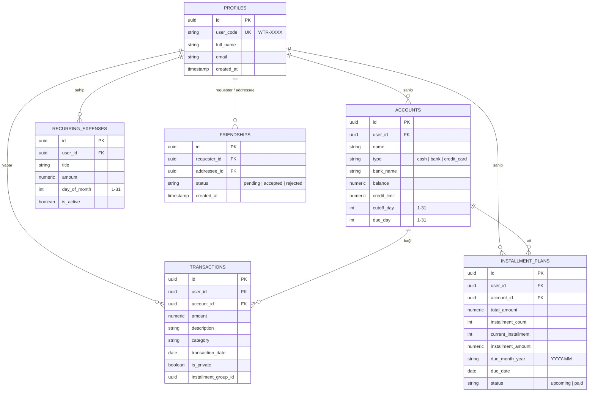

# 💳 ParaTakip — Kişisel Muhasebe & Taksit Takip PWA

<div align="center">


<p align="center">
  <b>Mobil öncelikli (Mobile-First PWA), ekstre kesim gününe duyarlı akıllı taksit simülatörlü ve kod tabanlı sosyal harcama takip uygulaması.</b>
  <br />
  iOS Safari "Ana Ekrana Ekle" mantığıyla tam native hissiyatta çalışır.
</p>

<p align="center">
  <a href="https://project-bank-black.vercel.app/" target="_blank">
    
  </a>
  <br />
  🔗 <b>Canlı Kullanım:</b> <a href="https://project-bank-black.vercel.app/" target="_blank">https://project-bank-black.vercel.app/</a>
</p>

</div>

---

## 📑 İçindekiler
- [Canlı Uygulama](#-canlı-uygulama)
- [Öne Çıkan Özellikler](#-öne-çıkan-özellikler)
- [Tasarım & Renk Paleti](#-tasarım--renk-paleti)
- [Teknoloji Yığını](#-teknoloji-yığını)
- [Mimari & Veritabanı Şeması](#-mimari--veritabanı-şeması)
- [Akıllı Taksit Motoru Mantığı](#-akıllı-taksit-motoru-mantığı)
- [Güvenlik & Row Level Security (RLS)](#-güvenlik--row-level-security-rls)
- [Hızlı Kurulum & Çalıştırma](#-hızlı-kurulum--çalıştırma)
- [Lisans](#-lisans)

---

## 🚀 Öne Çıkan Özellikler

### 1. ⚡ Akıllı Taksit Motoru & Gelecek Ay Yükü
* Kredi kartının **ekstre kesim gününe (`cutoff_day`)** ve işlem tarihine göre taksitlerin ilk başlangıç ayını otomatik belirler.
* İşlem günü ekstre gününden sonraysa ilk taksit doğrudan sonraki ayın ekstresine aktarılır.
* Küsurat farklarını son taksite ekleyerek kuruşu kuruşuna denk gelecek şekilde aylara dağıtır.
* **Gelecek Ay Yükü:** Önümüzdeki ay kart ekstrenize düşecek taksitler ile aktif sabit giderlerin (kira, aidat, abonelikler) toplamını anlık hesaplar.

### 2. 💰 Nakit & Kart Ayrımı
* **Nakit Alanı:** Doğrudan cüzdan bakiyenizi yönetir. Nakit gelirler (`+`) ve nakit harcamalar (`-`) cüzdandan düşer/eklenir.
* **Kartlar Alanı:** Banka kartları ve kredi kartları (Kart Adı, Banka, Tip, Limit, Güncel Borç, Ekstre Günü ve Son Ödeme Günü) bağımsız olarak yönetilir.

### 3. 🌓 Doğal Koyu Mod (Dark Mode) Desteği
* `next-themes` ile hem sistem temasını (açık/koyu) algılar hem de manuel Güneş/Ay ikonuyla tek tıkla değiştirilebilir.
* **Zifiri siyah (#000000) kullanılmamıştır.** Paletin ruhuna uygun doğal derin zümrüt (`#0F1715`), antrasit kartlar (`#182421`) ve açık krem (`#F1EFEA`) tonları kullanılmıştır.
* iOS Safari ve Android sistem durum çubuğu (`theme-color`) hem açık hem koyu mod için dinamik uyumludur.

### 4. 👥 Gerçek Kod Tabanlı Arkadaşlık & Gizlilik Garantisi
* Sahte veya mock arkadaş yok! Her kullanıcıya benzersiz 6 haneli kod atanır (Örn: `WTR-8492`).
* Karşı tarafın kodu girildiğinde Supabase `friendships` tablosuna gerçek istek atılır ve onaylandığında arkadaş akışı başlar.
* **Gizlilik Garantisi:** Kredi kartı borçları, banka bakiyeleri ve limitler arkadaşa **KESİNLİKLE GİZLİDİR**; yalnızca gizli olmayan (`is_private = false`) harcamalar sosyal akışta listelenir.

### 5. 🎯 Minimalist ve Sade 3 Bloklu Ana Ekran
* **1. Blok (Üst):** Toplam Nakit ve Toplam Kredi Kartı Borcu (2 sade kutucuk).
* **2. Blok (Orta):** Gelecek Ay Taksit Yükü (Tek satır net ödeme toplamı).
* **3. Blok (Alt):** Tanımlı Kartlarım ve Son Harcamalar.
* **Alt Menü (3 Sekme):** `Özet` • `Ortada Yüzen (+) Butonu` • `Taksitler` • `Arkadaşlar`.

---

## 🎨 Tasarım & Renk Paleti

| Mod | Arka Plan | Kartlar & Yüzeyler | Kenarlıklar | Ana Metin | Birincil Vurgu | İkincil Vurgu |
|:---:|:---:|:---:|:---:|:---:|:---:|:---:|
| **Açık (Light)** | `#F9F8F6` (Krem) | `#FFFFFF` | `#E8E3DD` (Vizon) | `#1A3636` (Koyu Teal) | `#1A3636` | `#678E77` (Adaçayı) |
| **Koyu (Dark)** | `#0F1715` (Zümrüt) | `#182421` | `#263834` (Antrasit) | `#F1EFEA` (Krem) | `#7EA68E` (Canlı Adaçayı) | `#2E4A42` |

---

## 🛠️ Teknoloji Yığını

* **Framework:** Next.js 16.4.0 (App Router, Turbopack, React 19)
* **Dil:** TypeScript 5
* **Stil:** Tailwind CSS v4, Lucide React ikonları, Glassmorphism
* **Tema:** `next-themes` (Sistem tercihi & manuel toggle)
* **Veritabanı & Kimlik Doğrulama:** Supabase (@supabase/ssr, Supabase Auth, PostgreSQL, Row Level Security)
* **PWA:** Standalone manifest (`manifest.json`), Apple Touch Icon, `viewport-fit=cover`

---

## 🗄️ Mimari & Veritabanı Şeması



---

## 🧮 Akıllı Taksit Motoru Mantığı

```
                     [ Yeni Taksitli Harcama ]
                                |
             +------------------+------------------+
             |                                     |
    Harcama Günü <= Ekstre Günü           Harcama Günü > Ekstre Günü
             |                                     |
     İlk Taksit: BU AY                     İlk Taksit: GELECEK AY
             \                                     /
              +-----------------+-----------------+
                                |
                     [ Tutar / Taksit Sayısı ]
                                |
         Kuruş farkı son taksite eklenerek eşit dilimlenir
                                |
             [ Gelecek Aylara Otomatik Dağıtım ]
```

---

## 🔒 Güvenlik & Row Level Security (RLS)

* `accounts`: Sadece hesap sahibi okuyabilir, ekleyebilir ve silebilir. **Arkadaşlara KESİNLİKLE kapalıdır.**
* `installment_plans` & `recurring_expenses`: Yalnızca hesap sahibi erişebilir.
* `transactions`: Kullanıcı kendi işlemlerini yönetir. Onaylı arkadaşlar **yalnızca** `is_private = false` olan harcamaları görebilir.
* `friendships`: Yalnızca taraf olan kullanıcılar görüntüleyebilir ve durumunu güncelleyebilir.

---

## 💻 Hızlı Kurulum & Çalıştırma

### 1. Depoyu Klonlayın
```bash
git clone https://github.com/tarikmirzaomerli/Project-Bank.git
cd Project-Bank
```

### 2. Bağımlılıkları Yükleyin
```bash
npm install
```

### 3. Çevre Değişkenlerini Tanımlayın
`.env.example` dosyasını `.env.local` olarak kopyalayın:
```bash
cp .env.example .env.local
```
Supabase Dashboard > Settings > API bölümünden aldığınız bilgileri girin:
```env
NEXT_PUBLIC_SUPABASE_URL=https://projeniz.supabase.co
NEXT_PUBLIC_SUPABASE_ANON_KEY=anon-anahtariniz
```

### 4. Supabase SQL Migration'ı Çalıştırın
Supabase Dashboard > **SQL Editor** sayfasına gidin ve `supabase/migrations/20261008000001_initial_schema.sql` dosyasının içeriğini yapıştırıp **Run** butonuna basın.

### 5. Geliştirme Sunucusunu Başlatın
```bash
npm run dev
```
Tarayıcınızda [http://localhost:3000](http://localhost:3000) adresini açın.

---

## 🌐 Canlı Uygulama

Uygulamayı tarayıcınızda veya telefonunuzda anında canlı deneyimleyebilirsiniz:

👉 **[https://project-bank-black.vercel.app/](https://project-bank-black.vercel.app/)**

> 💡 **PWA İpucu:** iOS Safari'de **Paylaş > Ana Ekrana Ekle** veya Android Chrome'da **Uygulamayı Ekle** seçeneğini kullanarak telefonunuzda tam ekran bir native uygulama deneyimi yaşayabilirsiniz.

---

## 📄 Lisans
Bu proje [MIT Lisansı](LICENSE) kapsamında lisanslanmıştır.
